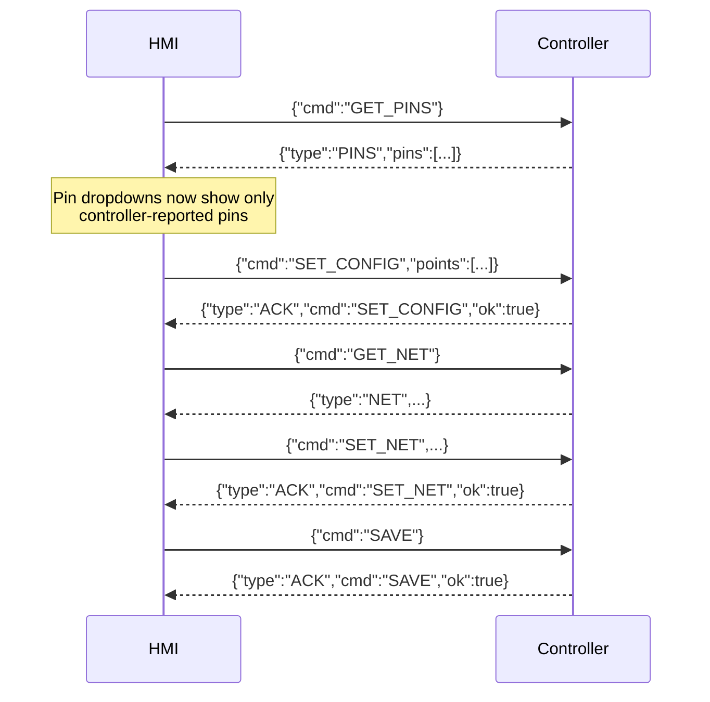

# Oceo HMI — Serial Protocol

This document describes the wire protocol spoken between the HMI (browser, via the
[Web Serial API](https://developer.mozilla.org/en-US/docs/Web/API/Web_Serial_API)) and
the field controller. It's the contract a firmware implementer needs to satisfy for
the **I/O Config** and **Network** pages to work.

Source of truth in code: [`src/serial/protocol.ts`](../src/serial/protocol.ts).

Each FlowHub board is a separate USB serial connection -- the HMI can hold a
port open per hub concurrently (via `getSerialClient(hubId)` in
[`src/serial/serialClient.ts`](../src/serial/serialClient.ts)), subject to
the operator granting the browser access to each physical port once. As
with the live relay protocol, there is no hub identifier in this wire
format; a hub's identity is entirely which serial port the messages flow
over.

## Transport

| Setting     | Value                                    |
|-------------|-------------------------------------------|
| Physical    | USB serial (CDC-ACM) or UART-to-USB adapter |
| Baud rate   | `115200`                                  |
| Framing     | One JSON object per line, terminated by `\n` |
| Encoding    | UTF-8 text                                |

Every message — request or response — is a single JSON object on its own line. The
HMI splits incoming bytes on `\n` and calls `JSON.parse` on each line independently,
so partial/binary noise on the line is simply ignored rather than crashing the link.

## Message 1 — Get Available Pins

Sent once on demand, when the operator clicks **Request Available Pins**. This is
the "start" handshake: the HMI asks the controller which GPIO pins actually exist
on this board before letting the operator assign them in the I/O table.

**HMI → Controller**

```json
{"cmd":"GET_PINS"}
```

**Controller → HMI**

```json
{"type":"PINS","pins":["PA0","PA1","PA2","PA3","PA4","PB0","PB1","PB2","PB3"]}
```

| Field  | Type       | Notes                                                             |
|--------|------------|---------------------------------------------------------------------|
| `type` | `"PINS"`   | Literal, identifies this as a pins response                        |
| `pins` | `string[]` | Every pin name the controller exposes, e.g. `"PA4"`, `"PB0"`        |

Once this response arrives, the HMI **replaces** its default pin dropdown options
(`PA0`–`PD15`) with exactly this list — so only pins the real hardware can offer are
selectable afterward. If the controller never responds, the HMI keeps using its
built-in default list.

## Message 2 — Set Configuration

Sent when the operator clicks **Send Configuration**. This pushes the operator's
full I/O mapping (every point's direction, signal type, and assigned pin) to the
controller in one shot.

**HMI → Controller**

```json
{
  "cmd": "SET_CONFIG",
  "points": [
    { "id": "tds1",      "name": "TDS-1",   "direction": "input",  "signalType": "analog",  "pin": "PA0" },
    { "id": "tds2",      "name": "TDS-2",   "direction": "input",  "signalType": "analog",  "pin": "PA1" },
    { "id": "flow1",     "name": "FLOW-1",  "direction": "input",  "signalType": "digital", "pin": "PA2" },
    { "id": "levelA",    "name": "LVL-A",   "direction": "input",  "signalType": "analog",  "pin": "PA3" },
    { "id": "levelB",    "name": "LVL-B",   "direction": "input",  "signalType": "analog",  "pin": "PA4" },
    { "id": "solenoid1", "name": "SOL-1",   "direction": "output", "signalType": "digital", "pin": "PB0" },
    { "id": "solenoid2", "name": "SOL-2",   "direction": "output", "signalType": "digital", "pin": "PB1" },
    { "id": "solenoid3", "name": "SOL-3",   "direction": "output", "signalType": "digital", "pin": "PB2" },
    { "id": "pump1",     "name": "PUMP-1",  "direction": "output", "signalType": "digital", "pin": "PB3" }
  ]
}
```

`points` always contains all 9 configured I/O points (5 inputs, 4 outputs) — see
[`src/config/ioDefaults.ts`](../src/config/ioDefaults.ts) for the canonical id/name
list. Every point object has:

| Field        | Type                    | Notes                                          |
|--------------|-------------------------|-------------------------------------------------|
| `id`         | `string`                | Stable point identifier, e.g. `"solenoid2"`     |
| `name`       | `string`                | Human-readable tag, e.g. `"SOL-2"`              |
| `direction`  | `"input" \| "output"`   | Whether the HMI reads or writes this point      |
| `signalType` | `"analog" \| "digital"` | Operator's chosen signal type                   |
| `pin`        | `string`                | Operator's chosen pin, e.g. `"PA4"`             |

**Controller → HMI**

```json
{"type":"ACK","cmd":"SET_CONFIG","ok":true}
```

Or, if the controller rejects the configuration (e.g. a pin doesn't exist, or two
points collide on the same physical pin):

```json
{"type":"ACK","cmd":"SET_CONFIG","ok":false,"message":"PB1 already assigned to SOL-1"}
```

| Field     | Type      | Notes                                              |
|-----------|-----------|-----------------------------------------------------|
| `type`    | `"ACK"`   | Literal, identifies this as an acknowledgement      |
| `cmd`     | `string`  | Echoes the command being acknowledged (`"SET_CONFIG"`) |
| `ok`      | `boolean` | Whether the controller accepted the configuration   |
| `message` | `string`  | Optional human-readable reason when `ok` is `false`  |

The HMI currently logs every `ACK` to the Wire Log but doesn't yet block/retry on
`ok: false` — that's a natural next step once real firmware exists to test against.

## Message 3 — Get Network Config

Sent when the operator clicks **Request Current Config** on the Network page. Asks
the controller which network stack(s) are configured/active, their credentials, and
live connectivity status.

**HMI → Controller**

```json
{"cmd":"GET_NET"}
```

**Controller → HMI**

```json
{
  "type": "NET",
  "mode": "11",
  "apn": "safaricom",
  "dev_eui": "6CF89C34A50EE97E",
  "join_eui": "ADDEE8A4E47A8A3F",
  "app_key": "4EC1F4EFF8314BF71EB32CDD5A855967",
  "region": "EU868",
  "adr": 1,
  "priority": "4g",
  "status": { "a7672": true, "lorawan": false }
}
```

| Field       | Type                  | Notes                                                      |
|-------------|-----------------------|-------------------------------------------------------------|
| `type`      | `"NET"`               | Literal, identifies this as a network-config response       |
| `mode`      | `"00"\|"01"\|"10"\|"11"` | offline / 4G only / LoRaWAN only / both (failover)        |
| `apn`       | `string`               | Only meaningful when 4G is part of `mode`                  |
| `dev_eui`, `join_eui`, `app_key` | `string`  | LoRaWAN OTAA identity, 16/16/32 hex chars               |
| `region`    | `string`               | Informational, e.g. `"EU868"`                               |
| `adr`       | `0\|1`                 | LoRaWAN adaptive data rate                                  |
| `priority`  | `"4g"\|"lora"`         | Which stack publishes while up, when `mode` is `"11"`       |
| `status`    | `{a7672, lorawan: boolean}` | Live connectivity, independent of `mode`               |

## Message 4 — Set Network Config

Sent when the operator clicks **Send Configuration** on the Network page. Applies
immediately on the controller but is **not** persisted until `SAVE` — same
apply-now/persist-later split as `SET_CONFIG`.

**HMI → Controller**

```json
{"cmd":"SET_NET","mode":"01","apn":"safaricom"}
```

Fields mirror the `GET_NET` response (`mode`/`apn`/`dev_eui`/`join_eui`/`app_key`/
`region`/`adr`/`priority`). Only send the fields relevant to the chosen `mode` --
`apn` is ignored/optional when 4G isn't part of the mode, LoRaWAN fields likewise.
`priority` falls back to whatever's currently active if omitted (it's only actually
required when `mode` is `"11"`).

**Controller → HMI**

```json
{"type":"ACK","cmd":"SET_NET","ok":true}
```

Or, e.g. if a pin the requested stack needs is already owned by an I/O channel:

```json
{"type":"ACK","cmd":"SET_NET","ok":false,"message":"PA2/PA3 needed for 4G -- clear channel 2 first"}
```

## Message 5 — Save to Flash

Sent when the operator clicks **Save to Flash** (available on both the I/O Config
and Network pages). Persists whatever is currently applied on the controller --
both I/O config and network config -- so it survives a reboot.

**HMI → Controller**

```json
{"cmd":"SAVE"}
```

**Controller → HMI**

```json
{"type":"ACK","cmd":"SAVE","ok":true}
```

## Sequence



## Notes for firmware implementers

- The HMI never sends anything unprompted beyond these five commands — there's no
  polling loop, so the controller doesn't need to worry about a flood of requests.
- Lines that aren't valid JSON, or JSON without a recognized `type`, are silently
  ignored by the HMI (they still show up in the Wire Log for debugging).
- There's no framing/checksum beyond the trailing `\n` — keep responses to a single
  line, and avoid embedding raw newlines inside string fields.
- The HMI opens the port at `115200` 8N1 with no flow control; match that on the
  device side or the link will just look silent.
- If the controller's network stack(s) involve blocking connect calls (a cellular
  modem's registration sequence, a LoRaWAN join), the link may go quiet for tens of
  seconds during a (re)connect attempt. The HMI has no timeout/retry on `GET_NET`,
  `SET_NET`, `GET_PINS`, or `SET_CONFIG` today, so a request sent during that window
  just waits for the next opportunity the controller has to read it -- the Wire Log
  will show the TX line with no RX response until then. Consider surfacing this in
  the UI (a "busy" indicator) if it turns out to be confusing in practice.
